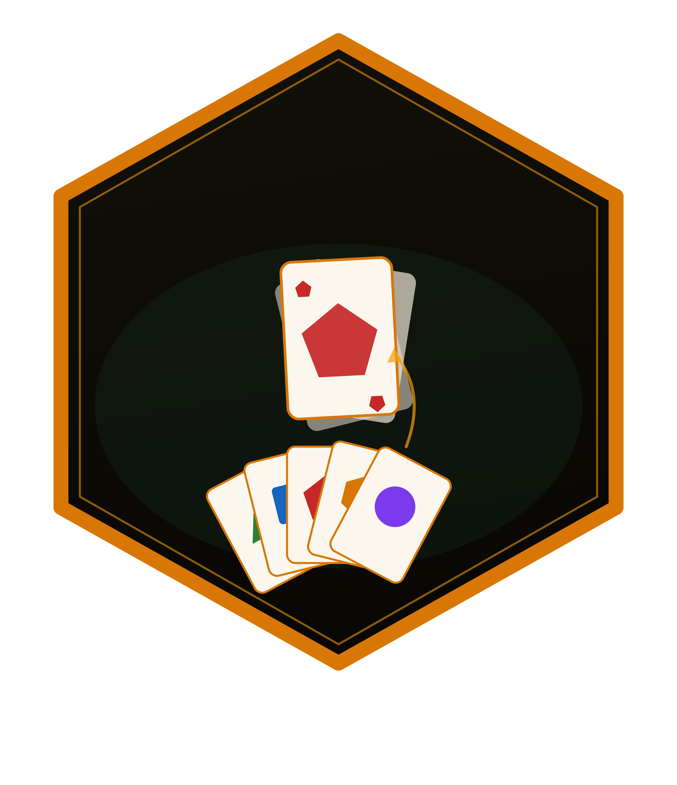

# maumauR 

<!-- badges: start -->
[](https://github.com/r-heller/maumauR/actions/workflows/R-CMD-check.yaml)
[](https://github.com/r-heller/maumauR/actions/workflows/pkgdown.yaml)
[](https://CRAN.R-project.org/package=maumauR)
[](https://app.codecov.io/gh/r-heller/maumauR?branch=main)
[](https://cran.r-project.org/package=maumauR)
[](https://cran.r-project.org/package=maumauR)
[](https://opensource.org/licenses/MIT)
[](https://lifecycle.r-lib.org/articles/stages.html#experimental)
<!-- badges: end -->

Simulation and analysis of the DB **"der kleine ICE" Mau Mau** card game - a
German children's Mau Mau variant with draw-two, skip, and wild cards.

## Features

- A configurable 32-card deck with a **single point of correction** in
  `mm_deck_spec()`; the engine, the summaries, the plots, and the app all read
  the deck from it
- A rules engine with true `+2` stacking, skips, wild colour choice, draw-pile
  reshuffling, and an optional "Mau" announcement penalty
- Turn-by-turn control (`mm_new_game()`, `mm_step()`) as well as whole games
  (`mm_play_game()`)
- Monte Carlo win-rate estimation by seat and player count
- Pluggable artificial strategies (greedy, random, hold-wilds), and a two-line
  recipe for writing your own
- Game-length and draw-count distribution summaries, all tidy tibbles
- An interactive Shiny application to play against the simulated opponents

## Installation

```r
# install.packages("remotes")
remotes::install_github("r-heller/maumauR")
```

## Quick start

```r
library(maumauR)

# One game, one tidy row
mm_play_game(n_players = 3, seed = 1)

# Many games
sims <- mm_simulate(n = 1000, n_players = 3, seed = 1)
mm_win_rate(sims)
mm_plot_win_rate(sims)

# Put strategies against each other
mixed <- mm_simulate(
  n = 1000,
  n_players = 3,
  strategies = list(
    mm_strategy_greedy(),
    mm_strategy_random(),
    mm_strategy_hold_wilds()
  ),
  seed = 2
)
mm_plot_strategy_compare(mixed)

# Play it yourself
mm_run_app()
```

## What the simulations say

Numbers below are from 4000 games per table size with identical greedy
opponents, and 1500 games per seat rotation for the head-to-head runs.

**Moving first helps, and win rate falls monotonically down the table.** At
three and four players the first seat is clearly above chance (its 95%
confidence interval excludes it); at two players the edge is within noise.

| Players | Seat 1 | Seat 2 | Seat 3 | Seat 4 | Chance |
|---------|--------|--------|--------|--------|--------|
| 2       | 0.515  | 0.485  |        |        | 0.500  |
| 3       | 0.375  | 0.325  | 0.300  |        | 0.333  |
| 4       | 0.283  | 0.249  | 0.245  | 0.223  | 0.250  |

**Hoarding wild cards pays.** Rotating one `hold_wilds` seat through every
position against greedy opponents, it finishes three to five points above
chance (0.550, 0.378, and 0.286 at two, three, and four players) - keeping a
card that is legal on any discard is worth more than the tempo lost by not
playing it. `mm_strategy_random()` goes the other way, winning 0.291 where the
greedy seats around it win 0.354, at three players.

**Games are short and right-skewed.** Mean turns and mean cards drawn both grow
by roughly five per extra player, but the tail is long: a four-player game
averages 29 turns and occasionally runs past 100.

| Players | Mean turns | Median | Max | Mean cards drawn |
|---------|-----------|--------|-----|------------------|
| 2       | 18.9      | 16     | 115 | 8.3              |
| 3       | 23.9      | 21     | 97  | 10.3             |
| 4       | 29.0      | 26     | 115 | 12.6             |

None of the 12000 simulated games failed to finish.

Reproduce any of these with `mm_simulate()` and the summary functions; see the
vignette for the code.

## The deck

> **Deck note:** The box lists 32 cards (`Inhalt: 32 Spielkarten`). Four
> colours, one `+2` and one skip per colour, and four wild cards leave exactly
> **five number faces per colour**, which is how `mm_deck_spec()` reaches 32.
> The face values themselves (`1:5`) are a reconstruction pending a physical
> card count. Correct them in `mm_deck_spec()` and everything downstream
> follows; any specification that does not total 32 is accepted but warns.

## Documentation

Reference and articles: <https://r-heller.github.io/maumauR/>

```r
vignette("maumauR")
```
