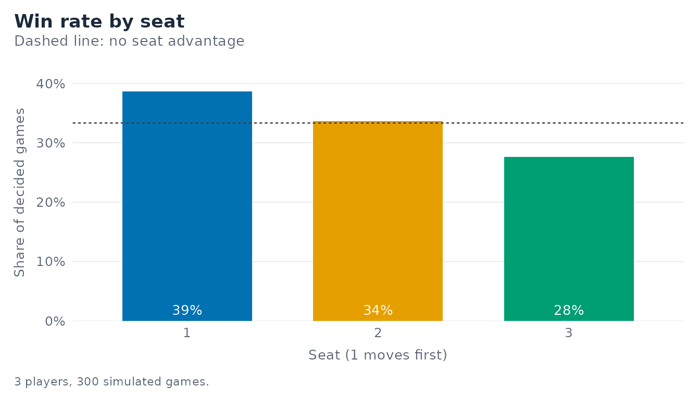
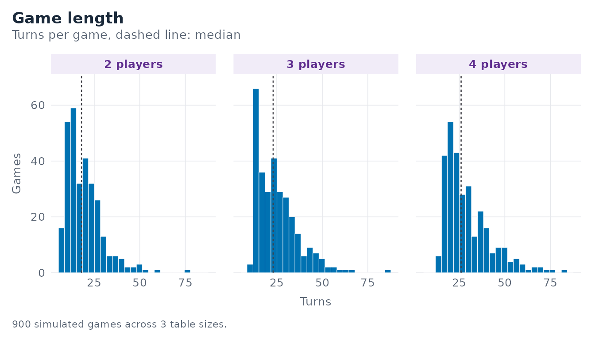
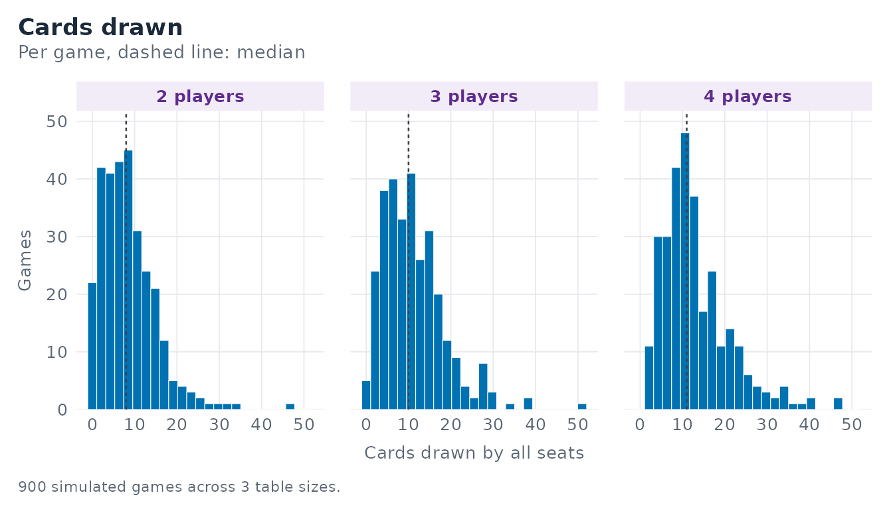
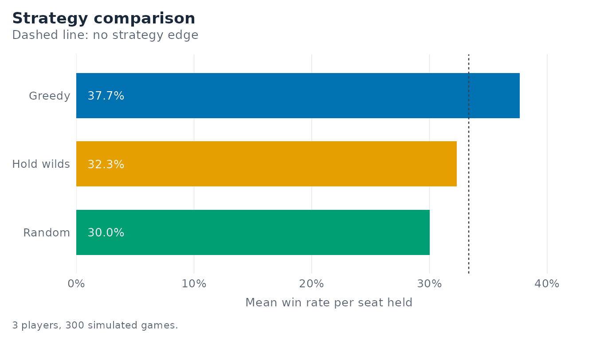
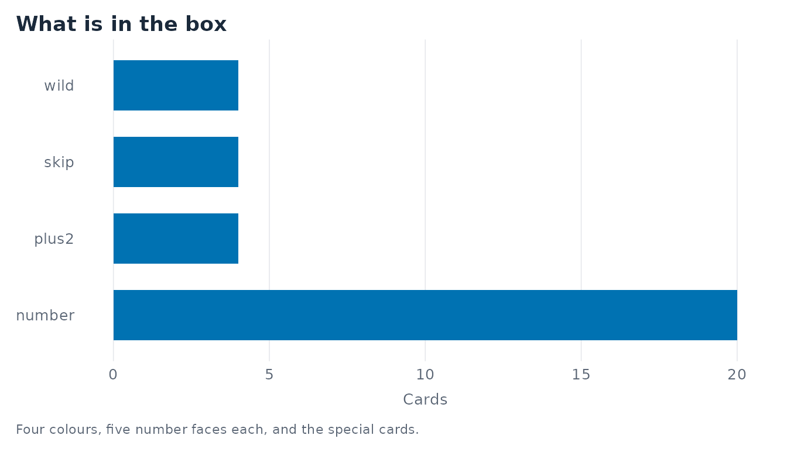

# Getting started with maumauR

You have a box of “der kleine ICE”, the Deutsche Bahn children’s Mau Mau
deck, and a question the box does not answer: does it matter where you
sit? This vignette walks from the deck to that answer in five minutes.

``` r

library(maumauR)
```

## The deck is the single source of truth

Everything the package does is derived from one specification.

``` r

spec <- mm_deck_spec()
spec
#> <mm_deck_spec>: 32 cards in 4 colours
#> • colours: "red", "green", "blue", and "yellow"
#> • number faces per colour: 1, 2, 3, 4, and 5
#> • +2 per colour: 1; skip per colour: 1
#> • wild cards: 4
#> • cards per colour: 7
```

The box states 32 cards. Four colours, one `+2` and one skip per colour,
and four wild cards leave exactly five number faces per colour - which
is how the default gets to 32. The face values are `1:5`, confirmed
against the physical deck; change them here and every simulation,
summary, and plot in the package follows.

Any specification that does not total 32 is accepted, but it warns, so a
wrongly built deck can never pass unnoticed:

``` r

wrong <- try(mm_deck_spec(numbers = 0:5), silent = TRUE)
#> Warning: ! The deck specification totals 36 cards, but the box states 32.
#> ℹ Correct the `mm_deck_spec()` arguments after a physical card count; every
#>   simulation, summary, and plot follows from them.
```

[`mm_build_deck()`](https://r-heller.github.io/maumauR/reference/mm_build_deck.md)
turns the specification into one row per physical card:

``` r

deck <- mm_build_deck(spec)
deck
#> # A tibble: 32 × 3
#>    color value type  
#>    <chr> <int> <chr> 
#>  1 red       1 number
#>  2 red       2 number
#>  3 red       3 number
#>  4 red       4 number
#>  5 red       5 number
#>  6 green     1 number
#>  7 green     2 number
#>  8 green     3 number
#>  9 green     4 number
#> 10 green     5 number
#> # ℹ 22 more rows
table(deck$type)
#> 
#> number  plus2   skip   wild 
#>     20      4      4      4
```

## One game

[`mm_play_game()`](https://r-heller.github.io/maumauR/reference/mm_play_game.md)
deals a table, plays it out against artificial opponents, and returns a
single tidy row.

``` r

mm_play_game(n_players = 3, seed = 1)
#> # A tibble: 1 × 7
#>   winner turns draws n_players hand_sizes strategy  trace           
#>    <int> <int> <int>     <int> <list>     <list>    <list>          
#> 1      1    35    16         3 <int [3]>  <chr [3]> <tibble [0 × 7]>
```

The `trace` column is the audit trail. Switch it on and every step
records the size of every pile, which is how the package checks that no
card is ever lost or duplicated:

``` r

traced <- mm_play_game(n_players = 3, seed = 1, trace = TRUE)
head(traced$trace[[1]])
#> # A tibble: 6 × 7
#>    turn player action       hand_cards draw_pile discard_pile total
#>   <int>  <int> <chr>             <int>     <int>        <int> <int>
#> 1     0      1 deal                 15        16            1    32
#> 2     1      1 play_plus2           14        16            2    32
#> 3     2      2 draw_penalty         16        14            2    32
#> 4     3      3 play_plus2           15        14            3    32
#> 5     4      1 draw_penalty         17        12            3    32
#> 6     5      2 play_wild            16        12            4    32
unique(traced$trace[[1]]$total)
#> [1] 32
```

## Turn by turn

For an interactive front end - or for understanding a rule - play one
action at a time.

``` r

game <- mm_new_game(n_players = 3, seed = 42)
game
#> <mm_game>: 3 players, turn 0
#> • top card: "number" "red" (colour in force: "red")
#> • hand sizes: 5, 5, and 5
#> • draw pile: 16; discard pile: 1
#> • to move: seat 1
mm_top_card(game)
#> # A tibble: 1 × 4
#>   color value type   active_color
#>   <chr> <int> <chr>  <chr>       
#> 1 red       3 number red
mm_hand(game, player = 1)
#> # A tibble: 5 × 5
#>    card color  value type   legal
#>   <int> <chr>  <int> <chr>  <lgl>
#> 1    17 yellow     2 number FALSE
#> 2    25 blue      NA plus2  FALSE
#> 3    18 yellow     3 number TRUE 
#> 4     7 green      2 number FALSE
#> 5    14 blue       4 number FALSE
mm_legal_moves(game)
#> [1] 3
```

[`mm_step()`](https://r-heller.github.io/maumauR/reference/mm_step.md)
advances the game. Left alone it asks the seat’s strategy; given a card
position it plays that card, which is what the Shiny application does
with your clicks.

``` r

game <- mm_step(game, card = mm_legal_moves(game)[[1]])
game
#> <mm_game>: 3 players, turn 1
#> • top card: "number" "yellow" (colour in force: "yellow")
#> • hand sizes: 4, 5, and 5
#> • draw pile: 16; discard pile: 2
#> • to move: seat 2
```

## Many games

[`mm_simulate()`](https://r-heller.github.io/maumauR/reference/mm_simulate.md)
repeats the whole thing and returns one row per game.

``` r

sims <- mm_simulate(n = 300, n_players = 3, seed = 7)
sims
#> # A tibble: 300 × 8
#>     game winner turns draws n_players hand_sizes strategy  trace           
#>    <int>  <int> <int> <int>     <int> <list>     <list>    <list>          
#>  1     1      1    13     2         3 <int [3]>  <chr [3]> <tibble [0 × 7]>
#>  2     2      2    17     6         3 <int [3]>  <chr [3]> <tibble [0 × 7]>
#>  3     3      3    15     4         3 <int [3]>  <chr [3]> <tibble [0 × 7]>
#>  4     4      2    32    13         3 <int [3]>  <chr [3]> <tibble [0 × 7]>
#>  5     5      2    13     3         3 <int [3]>  <chr [3]> <tibble [0 × 7]>
#>  6     6      3    14     1         3 <int [3]>  <chr [3]> <tibble [0 × 7]>
#>  7     7      1    23    13         3 <int [3]>  <chr [3]> <tibble [0 × 7]>
#>  8     8      2    43    24         3 <int [3]>  <chr [3]> <tibble [0 × 7]>
#>  9     9      2    29    12         3 <int [3]>  <chr [3]> <tibble [0 × 7]>
#> 10    10      2    20    11         3 <int [3]>  <chr [3]> <tibble [0 × 7]>
#> # ℹ 290 more rows
```

### Does the seat matter?

``` r

mm_win_rate(sims)
#> # A tibble: 3 × 6
#>   n_players  seat strategy  wins games win_rate
#>       <int> <int> <chr>    <int> <int>    <dbl>
#> 1         3     1 greedy     116   300    0.387
#> 2         3     2 greedy     101   300    0.337
#> 3         3     3 greedy      83   300    0.277
```

``` r

mm_plot_win_rate(sims)
```



Seat 1 moves first and gets there first often enough to show up: with
identical opponents, the first seat wins more than its share, and the
win rate falls monotonically down the table. Three hundred games is not
enough to pin that down - over 4000 games per table size the first seat
sits at 0.515 (two players), 0.375 (three), and 0.283 (four), against
chance levels of 0.500, 0.333, and 0.250.

### How long do games run, and how much drawing is there?

``` r

by_size <- dplyr::bind_rows(
  mm_simulate(n = 300, n_players = 2, seed = 21),
  mm_simulate(n = 300, n_players = 3, seed = 22),
  mm_simulate(n = 300, n_players = 4, seed = 23)
)

mm_game_length(by_size)
#> # A tibble: 3 × 7
#>   n_players games mean_turns sd_turns min_turns median_turns max_turns
#>       <int> <int>      <dbl>    <dbl>     <dbl>        <dbl>     <dbl>
#> 1         2   300       19.3     9.83         7           18        77
#> 2         3   300       25.1    11.4         10           23        86
#> 3         4   300       29.5    12.6         14           26        82
mm_draw_summary(by_size)
#> # A tibble: 3 × 7
#>   n_players games mean_draws sd_draws min_draws median_draws max_draws
#>       <int> <int>      <dbl>    <dbl>     <dbl>        <dbl>     <dbl>
#> 1         2   300       8.50     6.33         0            8        47
#> 2         3   300      11.2      7.26         0           10        51
#> 3         4   300      13.1      7.98         2           11        47
```

``` r

mm_plot_game_length(by_size, bins = 25)
```



``` r

mm_plot_draws(by_size, bins = 25)
```



Game length is strongly right-skewed: most games end quickly, a few drag
on while the `+2` cards circulate.

## Comparing strategies

Three strategies ship with the package, and writing your own is a matter
of writing a function. Seat them at one table and see:

``` r

mixed <- mm_simulate(
  n = 300,
  n_players = 3,
  strategies = list(
    mm_strategy_greedy(),
    mm_strategy_random(),
    mm_strategy_hold_wilds()
  ),
  seed = 11
)
mm_win_rate(mixed)
#> # A tibble: 3 × 6
#>   n_players  seat strategy    wins games win_rate
#>       <int> <int> <chr>      <int> <int>    <dbl>
#> 1         3     1 greedy       113   300    0.377
#> 2         3     2 random        90   300    0.3  
#> 3         3     3 hold_wilds    97   300    0.323
```

``` r

mm_plot_strategy_compare(mixed)
```



Three hundred games at one seating is a demonstration, not evidence.
Rotating a single `hold_wilds` seat through every position against
greedy opponents, 1500 games per rotation, hoarding does pay: it lands
at 0.550 (two players), 0.378 (three), and 0.286 (four) against chance
levels of 0.500, 0.333, and 0.250. A wild card is legal on any discard,
and that insurance against a forced draw is worth more than the tempo
lost by holding it.
[`mm_strategy_random()`](https://r-heller.github.io/maumauR/reference/mm_strategy.md)
goes the other way, finishing below chance and below greedy.

## Matching the figures

Every plot is an ordinary `ggplot` object, so you can keep building on
it. The theme the package draws in is exported too, which is the
shortest way to make a figure of your own sit beside the others.

``` r

ggplot2::ggplot(mm_build_deck(), ggplot2::aes(y = type)) +
  ggplot2::geom_bar(fill = "#0072B2", width = 0.66) +
  ggplot2::labs(
    title = "What is in the box",
    x = "Cards",
    y = NULL,
    caption = "Four colours, five number faces each, and the special cards."
  ) +
  mm_theme() +
  ggplot2::theme(panel.grid.major.y = ggplot2::element_blank())
```



## Writing your own strategy

A strategy is a function of `(hand, state)` returning the position of
the card to play, or `NA` to draw and pass. It must return one of
`state$legal`.

``` r

lowest_first <- structure(
  function(hand, state) {
    if (length(state$legal) == 0) {
      return(NA_integer_)
    }
    legal <- state$legal
    values <- hand$value[legal]
    values[is.na(values)] <- 99L
    legal[[which.min(values)]]
  },
  class = c("mm_strategy", "function"),
  strategy_name = "lowest_first",
  color_picker = function(hand, state) state$active_color
)

mm_win_rate(mm_simulate(
  n = 200,
  n_players = 3,
  strategies = list(lowest_first, mm_strategy_greedy(), mm_strategy_greedy()),
  seed = 5
))
#> # A tibble: 3 × 6
#>   n_players  seat strategy      wins games win_rate
#>       <int> <int> <chr>        <int> <int>    <dbl>
#> 1         3     1 lowest_first    69   200    0.345
#> 2         3     2 greedy          76   200    0.38 
#> 3         3     3 greedy          55   200    0.275
```

## Playing it yourself

``` r

mm_run_app()
```

The application has four tabs: play a hand against the artificial
opponents, explore win rates by seat, compare strategies head to head,
and inspect the game-length and draw-count distributions.
